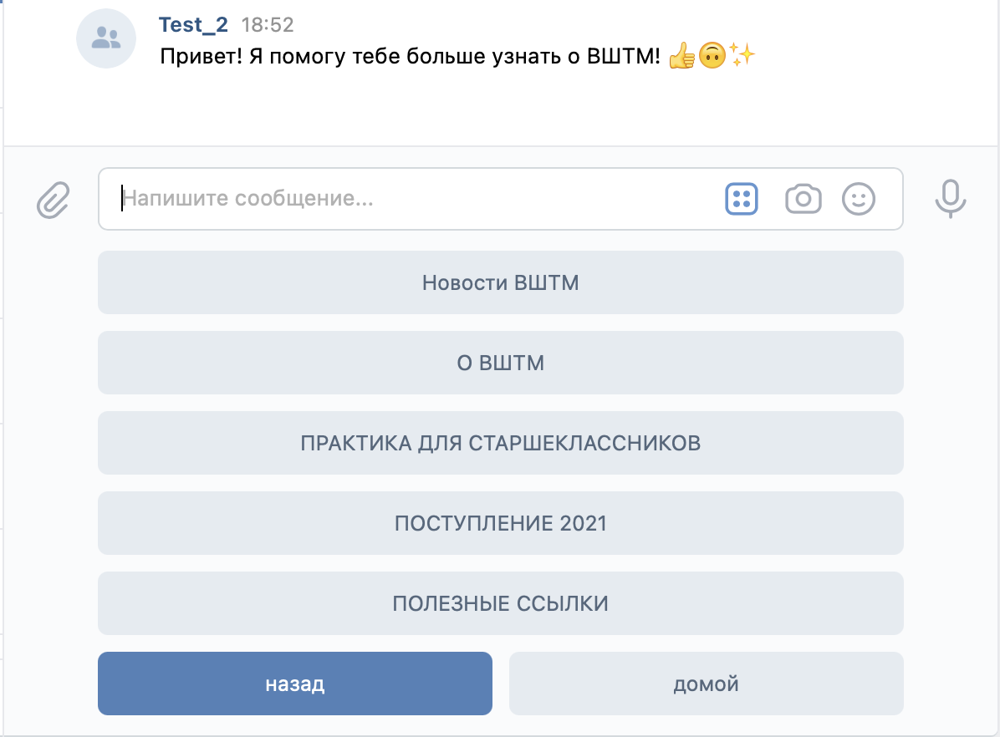
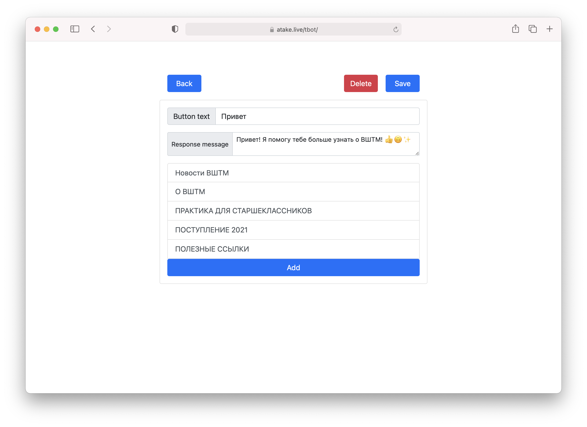
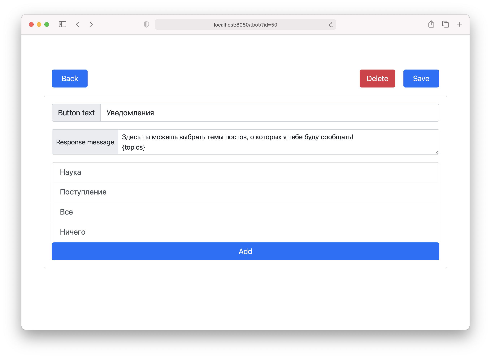
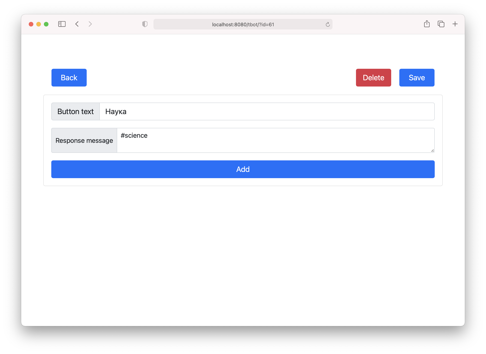

# TBot
A customizable bot for VK. The bot was made for [Theormech VK group](https://vk.com/theormech)

## About
The bot has a navigation system, developed to be driven by the bot keyboard,
but also can be used with a text input. The navigation system is stateless 
and fully customizable. The customization implemented with a web interface

This allows to edit Q&A system seamlessly without any delay. 
The editing web interface secured with a basic authentication provided by Spring Security.\
The navigation system has no strict limitation except VK's ones:
- No nesting limitation
- Max 9 items (VK limit)
- Max 40 characters for the Button text (VK limitation)

All information and the navigation structure has a consistent storage.

## Features
### Notification system

The advanced customizable notification system based on tags.\
Every post in a group with this bot will be searched for a tag – `#science`,
for example – and if an existing tag was found, the bot will send to subscribed users a message with the post.
To subscribe, a user must press a button with a tag in the `Response message` field.

The structure of subscription menu is fully customizable and can have nested options.
There are some service tags:
- `#all` – User will be subscribed to all topics.
- `#none` - User will be unsubscribed from all topics.
- `{topics}` – This special tag will print all user's subscriptions.
- `[SOME_LINK_WITH_HTTS]` - Creates a button-link. If pressed a user will be directed to a link inside brackets (`[` and `]`)

The system has a limitation – a name of a topic cannot be changed as well as a tag itself.
You must delete and create a new topic to change it. With topic deletion the users' subscriptions
will be deleted as well.

### Native attachments sending
The bot can parse vk urls with some attachment and natively send it.
To add an attachment you need just add a link somewhere in a response message. 
The link itself will be deleted, but the attachment will be added to a message.
It supports:
- photo
- video 
- audio
- doc – document
- wall – wall post


## Technical details
The bot was written in Java with Spring Framework. It uses the VK callback api. 
No api clients, no databases and no external java libraries used for this project.
Thymeleaf as a template engine. Spring Security was used for the authentication .\
Bootstrap as a component library.\
Minimal Java version – 14.

# Example of config file\

```
vk.access.key=
vk.group.confirmationCode=
tbot.notification.tag=#notify
notification.important.tag=\u0023\u0432\u0430\u0436\u043d\u043e\u0435\u0412\u0428\u0422\u041c

tbot.web.login=admin
tbot.web.password=mysuperduperpassword
```

# Docker 

Docker image usage:
```shell
docker run -v/path/to/persistent/storage:/storage -v/path/to/config/file/directory:/config <image-name>
```


